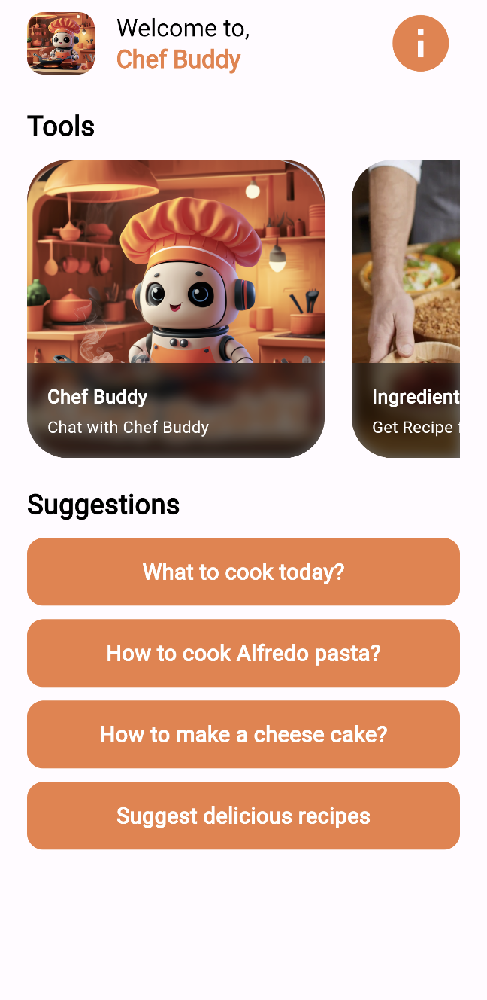

# Chef Buddy: AI Recipe Generator

Chef Buddy is an AI recipe generator developed during the Gemini Hackathon. It allows users to input ingredients or food images, set dietary preferences, and receive personalized recipes. This tool aims to reduce food waste and spark creativity in the kitchen.

## Screenshots

### Mobile View

1. Home Screen


2. Recipe Details


3. Ingredients List


4. Dietary Preferences


### Web View

1. Home Screen


2. Recipe Details


3. Ingredients List


4. Dietary Preferences


## How to Run

1. Clone the repository:
   ```
   git clone https://github.com/your-username/chefbuddy-gemini-hackathon.git
   ```

2. Update the API Key:
   - Navigate to the project folder.
   - Open `lib/constants/constants.dart`.
   - Replace `'YOUR_API_KEY'` with your actual API key.

3. Run the project using Flutter:
   ```
   flutter run
   ```

## Contributing

Contributions to Chef Buddy are welcome! If you find any issues or have suggestions for improvements, please open an issue or submit a pull request on GitHub.
